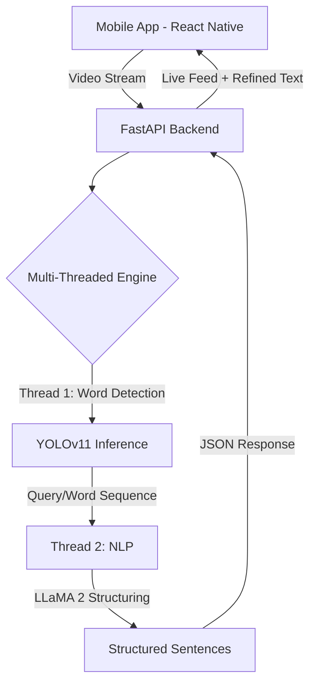

# 🖐️ Khudsuno: AI-Powered Sign Language Recognition

[](https://opensource.org/licenses/MIT)
[](https://www.python.org/downloads/)
[](https://reactnative.dev/)
[](https://ultralytics.com/)

**Khudsuno** (Urdu for "Listen to yourself") is a cutting-edge accessibility project designed to bridge the communication gap for the deaf and hard-of-hearing community. By combining real-time computer vision with advanced Large Language Models (LLMs), Khudsuno translates sign language gestures into coherent, natural sentences.

---

## 🌟 Key Features

- **Real-time Gesture Detection**: Powered by **YOLOv11**, achieving high accuracy in recognizing diverse sign language alphabet and word gestures.
- **Intelligent Sentence Synthesis**: Integrates **Meta LLaMA 2** to convert a stream of detected words into grammatically correct and contextually relevant sentences.
- **Cross-Platform Mobile App**: A sleek **React Native** frontend providing an intuitive user experience for real-time translation and profile management.
- **FastAPI Backend**: A high-performance asynchronous API handling the heavy lifting of ML inference.

---

## 🧠 Thought Process & Core Logic

The development of Khudsuno followed a rigorous engineering path to solve the "Isolated Word Problem" in sign language translation.

### 1. Model Training & Dataset
We utilized a custom-curated Pakistani Sign Language (PSL) dataset. The thought process was to use **YOLOv11n** (Nano) for its extreme efficiency on edge devices. By training on specific hand-gestures, we created a model that captures human intent directly through computer vision.

### 2. Multi-Threaded Execution Flow
To ensure a lag-free user experience, the backend operates on a sophisticated dual-thread architecture:

- **🧵 Thread 1: Perception & Word Collection**
  - Constantly monitors the camera feed using **OpenCV**.
  - Processes each frame through the YOLOv11 model to detect gestures.
  - **Logic**: It detects gestures and identifies the corresponding words. These words are then collected into a "bag of words" (a query) representing a nascent sentence.
  - Once a sentence break is detected (based on a 5-second inactivity timer), the entire collected query is sent to Thread 2.
  - Thread 1 immediately resets to start capturing the next word/sentence.

- **🧵 Thread 2: Sentence Structuring (The Brain)**
  - Receives the raw query (the sequence of detected words) from Thread 1.
  - Feeds this query into **Meta LLaMA 2**.
  - **The Magic**: LLaMA gives the sentence proper structure, grammar, and context. For example, it takes raw detections like `[ "hello", "help", "work" ]` and converts them into a meaningful sentence: *"Hello, I need help with work."*
  - The structured sentence is then displayed on the frontend in real-time.

---

## 🏗️ Architecture



---

## 🛠️ Tech Stack

- **Frontend**: React Native, React Navigation, Firebase
- **Backend**: FastAPI, Uvicorn, OpenCV
- **AI/ML**: Ultralytics YOLOv11, Hugging Face (LLaMA 2)
- **Inference**: CUDA-accelerated 4-bit Quantized LLaMA (using BitsAndBytes)

---

## 📂 Project Structure

```text
├── mobile-app/                 # React Native Frontend
├── backend/                    # FastAPI Server & ML Logic
│   ├── server.py               # Production Entry Point (Multi-threaded)
│   ├── psl_training.ipynb      # Pakistani Sign Language Training Logic
│   ├── yolo_experiments.ipynb  # Inference & Debugging experiments
│   ├── data.yaml               # Dataset Configuration
│   └── requirements.txt        # Backend Dependencies
└── README.md                   # Project Documentation
```

---

## 🚀 Quick Start

### Backend Setup
1. Install dependencies:
   ```bash
   cd backend
   pip install -r requirements.txt
   ```
2. Configure your local model paths in `server.py`.
3. Run the server:
   ```bash
   python server.py
   ```

### Mobile Setup
1. Install dependencies: `npm install` inside `mobile-app`.
2. Run the app: `npx react-native run-android`.

---

## 🤝 Contributing
Contributions are welcome! Please feel free to submit a Pull Request.

## 📄 License
This project is licensed under the MIT License.
