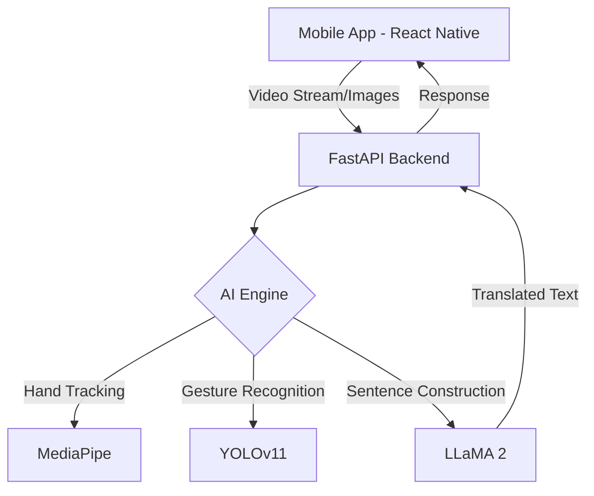

# 🖐️ Khudsuno: AI-Powered Sign Language Recognition

[](https://opensource.org/licenses/MIT)
[](https://www.python.org/downloads/)
[](https://reactnative.dev/)
[](https://ultralytics.com/)

**Khudsuno** (Urdu for "Listen to yourself") is a cutting-edge accessibility project designed to bridge the communication gap for the deaf and hard-of-hearing community. By combining real-time computer vision with advanced Large Language Models (LLMs), Khudsuno translates sign language gestures into coherent, natural sentences.

---

## 🌟 Key Features

- **Real-time Gesture Detection**: Powered by **YOLOv11**, achieving high accuracy in recognizing diverse sign language alphabet and word gestures.
- **Skeletal Rigging**: Uses **MediaPipe** for precise hand landmark tracking and bone rigging, ensuring robust detection even in varied lighting.
- **Intelligent Sentence Synthesis**: Integrates **Meta LLaMA 2** to convert a stream of detected words into grammatically correct and contextually relevant sentences.
- **Cross-Platform Mobile App**: A sleek **React Native** frontend providing an intuitive user experience for real-time translation and profile management.
- **FastAPI Backend**: A high-performance asynchronous API handling the heavy lifting of ML inference.

---

## 🏗️ Architecture



---

## 🛠️ Tech Stack

- **Frontend**: React Native, React Navigation, Firebase Auth/Firestore
- **Backend**: FastAPI, Uvicorn, OpenCV
- **AI/ML**: Ultralytics YOLOv11, MediaPipe, Hugging Face Transformers (LLaMA 2)
- **Deployment**: CUDA-accelerated inference for real-time performance

---

## 📂 Project Structure

```text
├── mobile-app/         # React Native Frontend
├── backend/            # FastAPI Server logic
│   ├── server.py               # FastAPI Server
│   ├── psl_training.ipynb      # Main Pakistani Sign Language training logic (Extracted)
│   ├── yolo_experiments.ipynb  # YOLOv11 testing and inference experiments
│   ├── data.yaml               # Dataset configuration
│   └── requirements.txt
├── models/             # Pre-trained ML weights
│   └── yolo11n.pt      # Sign Language Detection model
└── README.md
```

---

## 🚀 Quick Start

### Backend Setup
1. Clone the repository.
2. Install dependencies:
   ```bash
   cd backend
   pip install -r requirements.txt
   ```
3. Run the server:
   ```bash
   python server.py
   ```

### Mobile Setup
1. Navigate to the mobile directory:
   ```bash
   cd mobile-app
   npm install
   ```
2. Start the application:
   ```bash
   npx react-native run-android # or run-ios
   ```

---

## 🤝 Contributing
Contributions are welcome! Please feel free to submit a Pull Request.

## 📄 License
This project is licensed under the MIT License.
